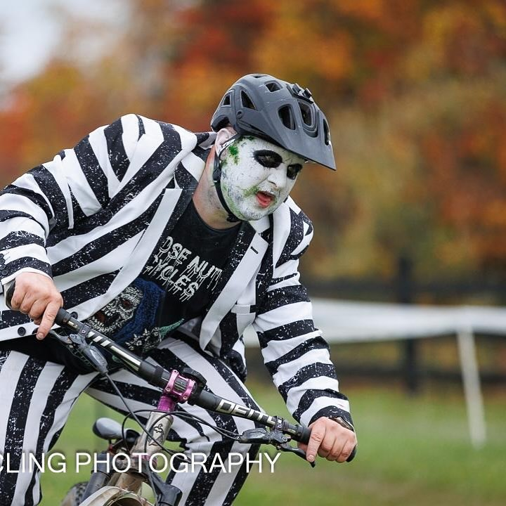

### Team Bikenetic
##### Cyclocross and mountain bike racing team in the Washington, DC region

Our premier event, BikenetiCX, will be on Sunday, October 26th at the [Loudon County Fair Grounds](https://loudouncountyfair.com/) in Leesburg, VA.   Registration opens on [BikeReg](https://bikereg.com/71991) on September 1.

Two excellent galleries of photos from last year's event are online from [Dominion Cycling Photography](https://dominioncyclingphotography.zenfolio.com/p929434141) and [Darrell Parks](https://darrellparks.smugmug.com/Bikenetic-CX-2024).

[📷 Dominion Cycling Photograhy](https://dominioncyclingphotography.zenfolio.com/)

#### Past events and results

BikenetiCX historical results:
- [2024 results](https://www.crossresults.com/race/12662)
- [2023 results](https://www.crossresults.com/race/11977)
- [2021 results](https://www.crossresults.com/race/10528)
- [2019 results](https://www.crossresults.com/race/9776)
- [2018 results](https://www.crossresults.com/race/8767)
- [2017 results](https://www.crossresults.com/race/7924)
- [2016 results](https://www.crossresults.com/race/6900)
- [2015 results](https://www.crossresults.com/race/5900)
- [2014 results](https://www.crossresults.com/race/4944)

Virtual events:
- A highlight of 2020 and 2021, we participated in Phoenix Bike's Raise + Ride events.
- We ran a new summer virtual event, ['We Should Go For a Bike Ride' Challenge](https://www.bikereg.com/wsgfabr). With your help we were able to raise approximately $19k USD for [Phoenix Bikes](https://www.phoenixbikes.org/), [MORE](https://more-mtb.org/), and [WABA](https://waba.org/).

In addition, we ran a gravel crit, Dirty BikenetiCrit! for four years. Results are here:
- [2019 results](https://www.crossresults.com/race/9082)
- [2018 results](https://www.road-results.com/race/10775)
- [2017 results](https://www.road-results.com/race/9552)
- [2016 results](https://www.road-results.com/race/8243)

##### About Team Bikenetic

We’re sponsored and fully supported by [Bikenetic Full Service Bike Shop](https://www.bikenetic.com/), 201 West Jefferson St, Falls Church VA 22046, phone 703-KEG-RIDE. Thanks to Bikenetic, we also enjoy superb equipment sponsorship from Industry Nine in addition to excellent local support from Falls Church businesses: [Stahl Homes LLC](http://stahlhomes.com/), [Cafe Kindred](http://www.cafekindred.com/), and [Clare and Don's Beach Shack](http://www.clareanddons.com/).

In the past we published a brief, weekly [podcast](https://overcast.fm/itunes1436089238/team-bikenetic-bicycle-shorts). It is public but oriented towards the team or interests of the team. Currently on a break, but might pick the mic back up this season. Feel free to subscribe, feedback is welcome. [Overcast](https://overcast.fm/itunes1436089238/team-bikenetic-bicycle-shorts), [iTunes](https://itunes.apple.com/us/podcast/team-bikenetic-bicycle-shorts/id1436089238?mt=2), or [Stitcher](https://www.stitcher.com/s?fid=233261).

Basically, we have fun in dirt. But we also do lots of public service and outreach: [MORE](http://www.more-mtb.org/) trail-building, [Bike to Work Day](https://www.biketoworkmetrodc.org/) support, [WABA](http://www.waba.org/) advocacy, and [Phoenix Bikes](http://www.phoenixbikes.org/) volunteering.

We started in 2014 with 25 members and now enjoy the pleasant company of ~75. We’re currently the size we want to be, but if you’re interested, get to know us at races and on rides, hang out with us, and let’s see if we’re a good fit for each other. Membership requires a stated annual commitment to racing and volunteering. For our ongoing activity, check us out on [Facebook](https://www.facebook.com/bikeneticx) and [Instagram](https://www.instagram.com/teambikenetic/).
